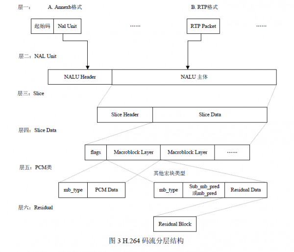

## 视频编解码
**视频编解码的由来**
> 从信息论的观点来看，描述信源的数据是信息和数据冗余之和，即：数据=信息+数据冗余。数据冗余有许多种，如空间冗余、时间冗余、视觉冗余、统计冗余等。将图像作为一个信源，视频压缩编码的实质是减少图像中的冗余。

### H.263与H.264的区别

#### 1.概述

会议电视公认的图像编码标准协议是H系列，即ITU-T H.261、H.263和H.264协议。

1995年之前，会议电视系统图像都采用H261编码协议。

1995年，ITU-T针对低比特率视频应用制定了H.263标准，当时H263被公认为是以像素为基础的采用第一代编码技术混合编码方案所能达到的最佳结果。尽管采用H263编码技术较H261编码在压缩率和图像质量上都有大幅度的提升，但H.263信源编码算法的核心仍然是H.261标准中采用的DPCM/DCT混和编码算法，原理框图也和H.261十分相似。

2001年12月，ITU-T和ISO两个国际标准化组织的有关视频编码的专家联合组成视频联合工作组（JVT，Joint Video Team），负责制定一个新的视频编码标准，以实现视频的高压缩比、高图像质量、良好的网络适应性等目标。随后JVT制定出的视频编码标准被ITU-T 定义为H.264；该标准也被ISO定义为14496-10（MPEG-4 第10部分）高级视频编码（AVC，Advanced Video Coding）标准。

H.264相对以前的编码方法，在图像内容预测方面提高了编码效率，采用可变块大小运动补偿、1/4采样精度运动补偿、加权预测等算法，改善了图像质量，增加了纠错功能和各种网络环境传输的适应性。测试结果表明，在中低带宽情况下，H.264具有比H.263++更优秀的PSNR性能：H.264的PSNR比H.263++平均要高3dB。所以目前业界主流视频会议系统厂家都推出了基于H.264的视讯产品。

H264编码技术使运动图像压缩技术上升到了一个更高的阶段，在较低带宽上提供高质量的图像传输是H.264的应用亮点。H.264的推广应用对视频终端、网关、MCU等系统的要求较高，目前只有真正有实力的厂家才有能力提供全线的产品。

#### 2.H263与H264的对比分析

H.264编码标准正在被其它行业认同，H264有可能成为广播、通信和存储媒体（CD、DVD）的统一的标准，即成为未来宽带交互新媒体的统一标准。

H.263 定义的码流结构是分级结构，共四层。自上而下分别为：图像层(picturelayer)、块组层(GOB  layer)、宏块层(macroblock  layer)和块层(block  layer)。而与H.263 相比，H.264的码流结构和H.263 的有很大的区别，它采用的不再是严格的分级结构。

H.264 支持4:2:0 的连续或隔行视频的编码和解码。H.264 压缩与H.263、MPEG-4 相比，视频压缩比提高了一倍。 H.264 的功能分为两层：视频编码层（VCL, Video Coding Layer）和网络提取层（NAL,Network Abstraction Layer）。VCL 数据即编码处理的输出，它表示被压缩编码后的视频数据序列。在VCL 数据传输或存储之前，这些编码的VCL 数据，先被映射或封装进NAL 单元中。每个NAL 单元包括一个原始字节序列负荷（RBSP, Raw Byte Sequence Payload）、一组对应于视频编码的 NAL 头信息。RBSP 的基本结构是：在原始编码数据的后面填加了结尾比特。一个bit“1”若干比特“0”，以便字节对齐。

> **annexb格式**，传统模式，有startcode，SPS和PPS是在ES中 ALU数据+开始前缀）；针对H.320电话会议

> **RTP格式**：NALU数据+20个字节的类似的并不符合RTP协议的RTP头。针对IP网络的RTP打包方式

从视频标准的发展来看，H.264作为国际两大标准组织确定的共同标准，全面覆盖了视频通信、广播、存储等各方面的应用，采用H264的视频标准协议的会议电视系统是是合理的选择。采用H264编码协议的优势：

不同大小和形状的宏块分割：H.264支持7种模式。提高了性能，减少了方块效应，提高了图像的质量。

高精度的亚像素运动补偿：运动估计后的残差小。

多帧预测：在帧间编码时，可选5个不同的参考帧，提供了更好的纠错性能，这样更可以改善视频图像质量。

去块滤波器：H.264定义了自适应去除块效应的滤波器，这可以处理预测环路中的水平和垂直块边缘，大大减少了方块效应。

4×4块的整数变换：由于用二变换块的尺寸缩小,运动物体的划分更精确,这样,不但变换计算量比较小,而且在运动物体边缘处的衔接误疾差也大为减小；

先进的量化方法：与H.263等的固定常数量化步长不同，*H.264步长是以12.5%的复合率递进的*，并对色度系数采用了较小量化步长。这些措施提高了码率控制的能力，并加强了彩色的逼真性。

### 扩展知识
- - -

#### IDR(刷新帧)与I帧的一些知识点

IDR帧属于I帧，但是I帧不一定是IDR帧。解码器收到IDR帧时，将驱动器参数块（DPB）清空。而I帧不会。由此可见，在编码器端，每发一个IDR，就相应地发一个nal。当然在现在的编码中，为了取得更高的图像质量，在一个视频文件中有好多个IDR帧，这些IDR帧把视频文件分成了片，但是每片中第一个帧是IDR，而且仅此一个

例如：存在这样一段视频:
 
码流	IDR	B	B	P	B	B	P	……
帧号	1	2	3	4	5	6	7	……
 
 
对IDR帧的处理(与I帧的处理相同)：(1) 进行帧内预测，决定所采用的帧内预测模式。(2) 像素值减去预测值，得到残差。(3) 对残差进行变换和量化。(4) 变长编码和算术编码。(5) 重构图像并滤波，得到的图像作为其它帧的参考帧。
这里要提一下，当编码器处理完IDR帧遇到B帧时，编码期先把其放入缓存器中存放起来。直接对P进行编码。即编码器中编码的实际顺序是IDR P B B P B B…..即1423756……

>IDR-instantaneous decoding refresh (IDR)picture; 
      A coded picture in which all slices are I or SI slices that causes the decoding process to mark all reference pictures as "unused for reference" immediately after decoding the IDR picture. After the decoding of an IDR picture all following coded pictures in decoding order can be decoded without inter prediction from any picture decoded prior to the IDR picture. The first picture of each coded video sequence is an IDR picture. 
    “也就是说,IDR的出现其实是相当于向解码器发出了一个清理reference buffer的信号吧，上面说前于这一帧的所有已编码帧不能为inter做参考帧了。” 

还有：“因为264采用了多帧预测，就有可能在display order下I帧后的P会参考I帧前的帧，这样在random access时如果只找I帧，随后的帧的参考帧可能unavailable，IDR就是这样一种特殊的I帧，把它定义为确保后面的P一定不参考其前面的帧，可以放心地random access。 ”
 
